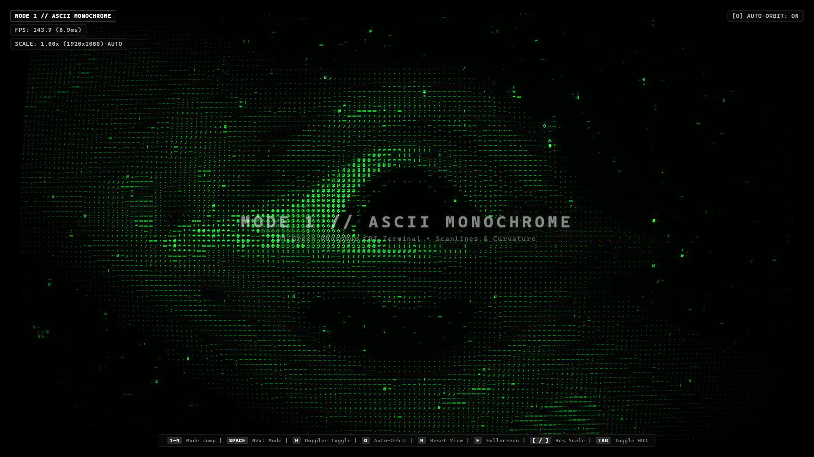
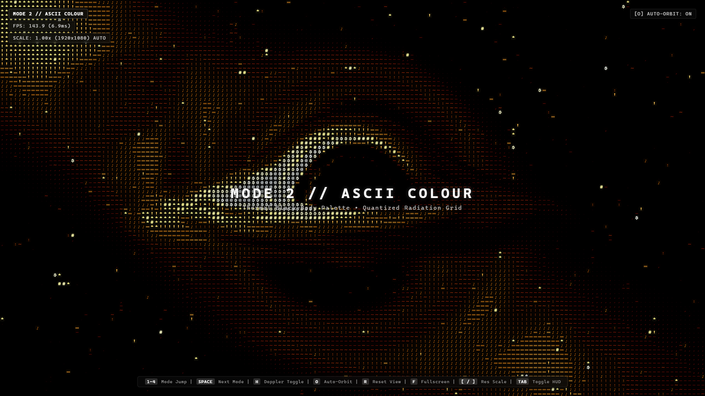
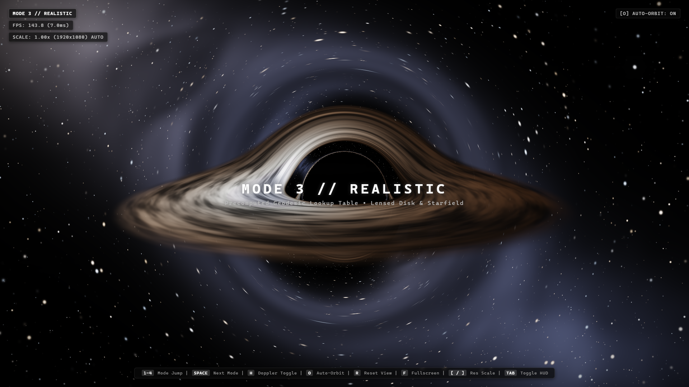
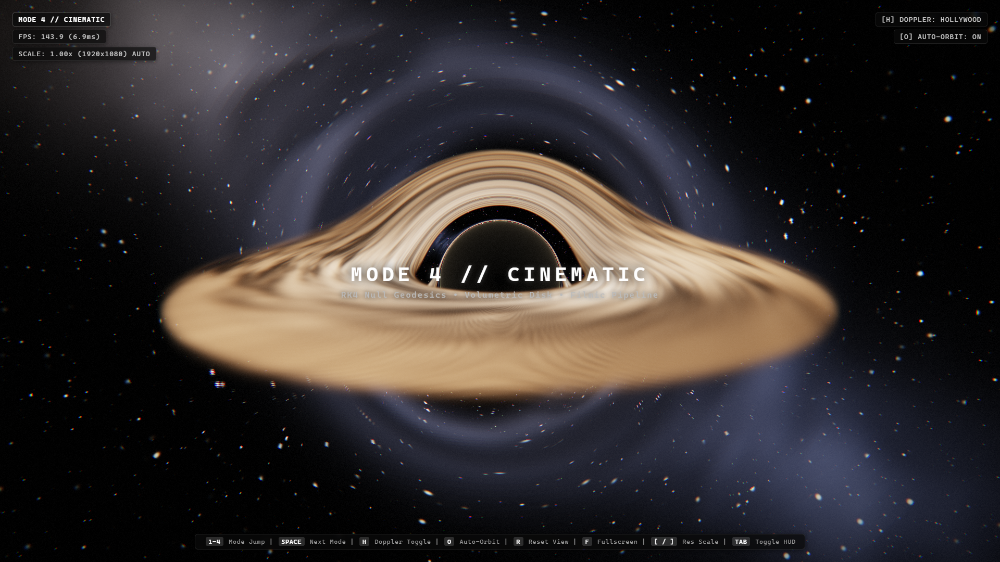

# ASCII Black Hole: Real-Time Relativistic Schwarzschild Renderer

[](https://www.python.org/)
[]()
[]()
[](https://opensource.org/licenses/MIT)

A real-time, interactive relativistic black hole visualizer available both as an in-browser WebGL2 application ([`index.html`](index.html)) and as a desktop Python/Pygame engine ([`blackhole.py`](blackhole.py)). It captures the iconic *Interstellar* / Jean-Pierre Luminet silhouette—central black hole shadow, gravitational lensing with double-lensed rear accretion disk halos, Keplerian differential shear, and relativistic Doppler beaming—running at **140–300+ FPS** using general relativistic null geodesics.

Inspired by [Andy Sloane's Donut Math](https://www.a1k0n.net/2011/07/20/donut-math.html) and [Tai Le's Spinning Donut](donut.html).

---

## 🌌 Web Experience: "Event Horizon" (`index.html`)

A single, self-contained HTML file (pure WebGL2 + inline GLSL, zero build steps, zero CDNs, works 100% offline). Double-click [`index.html`](index.html) in Chrome/Edge/Firefox or deploy directly via GitHub Pages!

### 4 Narrative Modes

| Mode 1: ASCII Monochrome CRT | Mode 2: ASCII Colour Thermal |
| :---: | :---: |
|  |  |
| *P1 Green Phosphor CRT Terminal, scanlines & bloom* | *Planckian black-body thermal radiation gradient* |

| Mode 3: Realistic Deflection LUT | Mode 4: Cinematic RK4 (Hollywood / Physical) |
| :---: | :---: |
|  |  |
| *Analytical Binet deflection LUT & lensed starfield* | *Per-pixel RK4 geodesics, volumetric disk & bloom* |

- **Mode 1 (ASCII Monochrome)**: Green phosphor terminal aesthetic with scanlines and glow.
- **Mode 2 (ASCII Colour)**: Quantized thermal black-body radiation ramp over the ASCII cell grid.
- **Mode 3 (Realistic)**: Smooth per-pixel render using a precomputed deflection lookup table, lensed stars, and dual accretion arches.
- **Mode 4 (Cinematic)**: Full per-pixel ray-marched null geodesics (RK4 integration of the photon orbit equation), continuous 3D volumetric disk, HDR bloom, anamorphic lens flares, and ACES filmic tone mapping.
  - Press **`H`** in Mode 4 to toggle between **Hollywood Mode** (symmetric golden disk) and **Physically Accurate Mode** (relativistic Doppler beaming & spectral blueshift).

### Web Controls (`index.html`)

| Input | Action |
| :--- | :--- |
| **`SPACE`** | Dismiss intro / Cycle forward to the next render mode |
| **`1` – `4`** | Jump directly to Mode 1, 2, 3, or 4 with smooth ~1s crossfade |
| **`H`** | In Mode 4: Toggle Hollywood (Symmetric Golden) vs Physical (Doppler Beamed) |
| **`O`** | Toggle Presenter Camera auto-orbit / cinematic drift |
| **Mouse Drag** | Orbit camera around the black hole |
| **Mouse Scroll** | Zoom camera closer / farther ($3.5\, r_s$ to $35.0\, r_s$) |
| **`R`** | Reset camera view to default inclination & distance |
| **`[` / `]`** | Decrease / increase dynamic render resolution scale |
| **`TAB`** | Toggle Minimalist HUD (FPS, telemetry, render scale) |
| **`F`** | Toggle Fullscreen |

---

## 🐍 Desktop Python Engine (`blackhole.py`)

A standalone desktop ASCII renderer in pure Python and Pygame running at 300+ FPS.

### Installation & Quick Start

```bash
# 1. Clone repository
git clone https://github.com/Officialletai/ASCII-Blackhole.git
cd ASCII-Blackhole

# 2. Install dependencies
pip install -r requirements.txt

# 3. Run the desktop renderer
python blackhole.py

# Optional flags:
python blackhole.py --fullscreen
python blackhole.py --speed 0.35
```

### Python Controls (`blackhole.py`)

| Input | Action |
| :--- | :--- |
| **`[` / `,`** | Slow down animation speed |
| **`]` / `.`** | Speed up animation speed |
| **`P` / `0`** | Pause / unpause swirl animation |
| **`F` / `F11`** | Toggle True Fullscreen on / off |
| **`Space`** | Reverse Keplerian accretion swirl direction |
| **`C`** | Toggle monochrome ASCII (`.,-~:;=!*#$@`) vs thermal heat colors |
| **Mouse Drag** | Interactive 3D camera orbit |
| **Scroll Wheel** / `+` / `-` | Zoom camera in and out |
| **`R`** | Reset camera view |
| **`H` / `Tab`** | Toggle HUD telemetry overlay |
| **`Esc`** | Exit fullscreen (or quit if windowed) |

---

## 📐 Mathematical Guide

For a complete first-principles walkthrough starting from **Pythagoras' Theorem** ($a^2 + b^2 = c^2$) and building step-by-step through spherical coordinates, 4D Minkowski spacetime, gravitational time dilation, the exact Schwarzschild metric, and null geodesics ($ds^2 = 0$), see:

👉 **[blackhole.md](blackhole.md)** — *The Complete Mathematical Guide*

---

## 🧪 Verification & Testing

### Python Test Suite
```bash
# Run 63 unit and integration tests
python test_blackhole.py

# Run built-in self-tests & benchmarks
python blackhole.py --test
python blackhole.py --benchmark
```

### WebGL / Web Test Suite (Node.js CDP)
```bash
# Run automated headless Chrome E2E test harness (32 tests)
node tests/qa_harness.mjs

# Run adversarial stress testing suite (9 scenarios)
node tests/stress_harness.mjs

# Run relativistic physics and shadow probe (17 assertions)
node tests/empirical_physics_probe.mjs
```

---

## 📂 Project Structure

```text
├── index.html          # WebGL2 standalone real-time visualizer ("Event Horizon")
├── blackhole.py        # Core desktop Python/Pygame ASCII engine
├── blackhole.md        # Comprehensive first-principles mathematical guide
├── test_blackhole.py   # Python test suite (63 unit tests)
├── tests/              # Automated WebGL2 headless QA & stress test harnesses
│   ├── qa_harness.mjs
│   ├── stress_harness.mjs
│   └── empirical_physics_probe.mjs
├── artifacts/          # 1080p rendered screenshots & QA report
├── donut.html          # Original inspiration article by Tai Le
├── requirements.txt    # Python dependencies
└── README.md           # Project documentation
```

---

## License

This project is licensed under the MIT License - see the [LICENSE](LICENSE) file for details.
